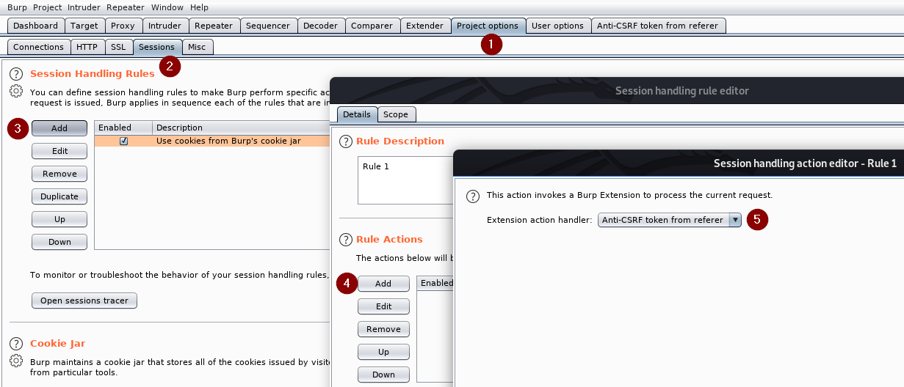
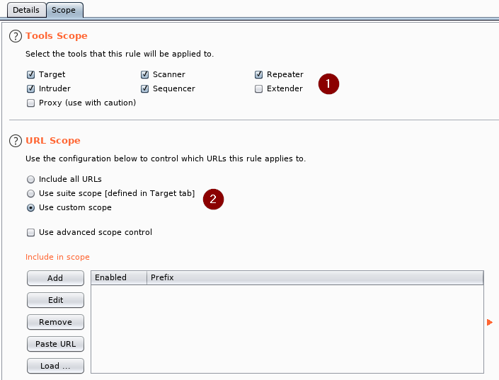
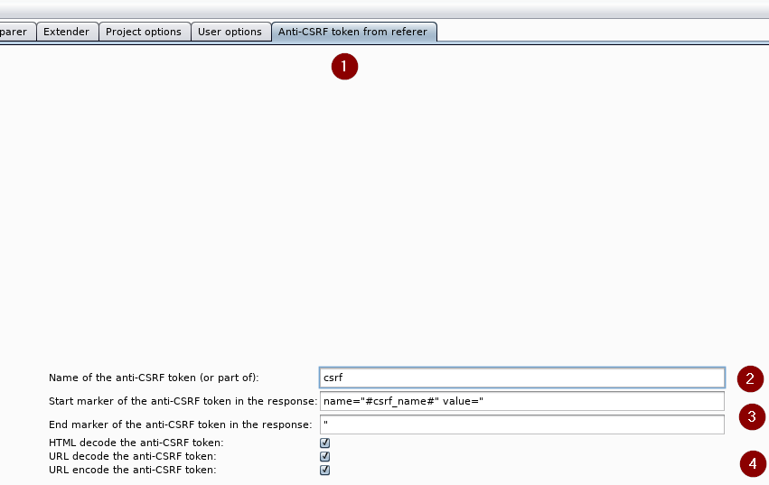

# Anti-CSRF token from referer
Anti-CSRF token from referer is a Burp Suite extension to automatically take care of anti-CSRF tokens by fetching them from the referer and replacing them in requests.

## Installation
The extension can be installed directly from the Burp Suite by going to the "Extender", then "BApp Store" tab, selecting the "Anti-CSRF token from referer" extension and click on "Install".

It can also be installed manually by downloading [the source code](Anti-CSRF_token_from_referer.py) and clicking on the "Add" button on the "Extender" tab.

## Usage
First of all, install the extension as explained in the previous chapter.

Then, create a new session handling rule:
1. Open the "Project options" tab
1. Go to "Sessions"
1. In "Session Handling Rules", click on "Add"
1. In "Rule Actions", click on "Add"
1. Choose "Invoke a Burp extension"
1. Choose "Anti-CSRF token from referer"
1. Click on "OK"



Continue by defining the scope:
1. Change to the the "Scope" tab
1. Define "Tools Scope", e.g. select "Extender" if you want it to be applied for other extensions as well
1. Define "URL Scope"
1. Click on "OK"



End by configuring the parameters:
1. Open the "Anti-CSRF token from referer" tab
1. Name: Name of the anti-CSRF token that will be searched for in the original request. Can also be a substring of the name, like `csrf` for `my-csrf-token` (useful in case the anti-CSRF token name is not static).
1. Start and end markers: Markers defining the start and the end for extracting the anti-CSRF token in the response. Can include the placeholder `#csrf_name#`, which is then replaced by the full name of the anti-CSRF token found in the original request (useful in case the anti-CSRF token name is not static).
1. Decode and encode: Define whether the anti-CSRF token has to be decoded and/or encoded before usage.



## Working
The extension works by registering a new session handling rule called "Anti-CSRF token from referer". This handler inspects all the requests and searches for the anti-CSRF token parameter (in GET, POST, JSON and multipart requests) determined by the name configured in the tab.

Once this parameter is found, a GET request is issued to the referer of the original request. In this request, all the headers are copied from the original request (e.g Cookie, Authorization...).

This response is then parsed and the substring between the start and the end markers configured in the tab is extracted as the anti-CSRF token.

Finally, the anti-CSRF token is replaced in the original request.

## Example
For the example, suppose that the following request is sent and is being handled by the extension, where the name of the anti-CSRF token is configured as `csrf`:
```
POST /submit HTTP/1.1
Host: www.example.com
Referer: https://www.example.com/form
Cookie: session=pSJYSScWKpmC60LpFOAHKixuFuM4uXWF
Content-Type: application/x-www-form-urlencoded
Content-Length: 67

email=me@example.com&my-csrf-token=rZHCnSzEp8dbI6atzagGoSYyqJqTz5dv
```

The extension will notice that the parameter `my-csrf-token` contains the name of the anti-CSRF token `csrf`. Therefore, it will send a GET request to the referer `https://www.example.com/form` with all the headers of the original request (except Host, Content-Length and Content-Type):
```
GET /form HTTP/1.1
Host: www.example.com
Referer: https://www.example.com/form
Cookie: session=pSJYSScWKpmC60LpFOAHKixuFuM4uXWF
```

Afterwards, it will extract the anti-CSRF token from the response as configured by the start and end markers (where `#csrf_name#` will be `my-csrf-token`) and replace it in the original request.

## Authors
This extension was written by [Thierry Viaccoz](https://github.com/viaccoz) and [Sylvain Heiniger](https://github.com/sploutchy).

## Changes

### 0.1
* Initial release
